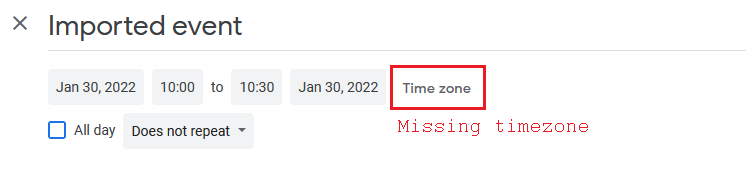
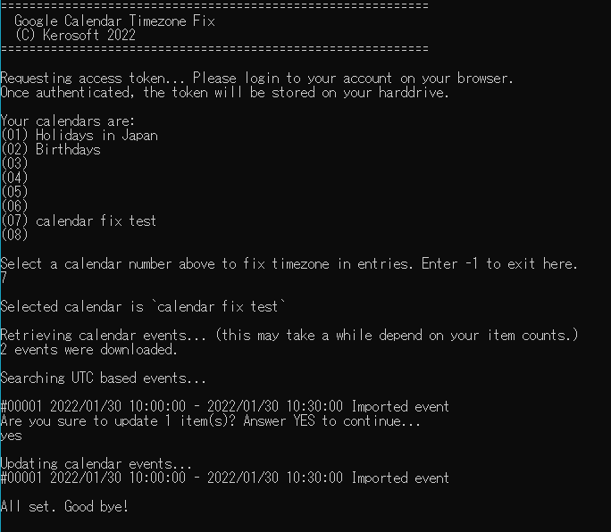
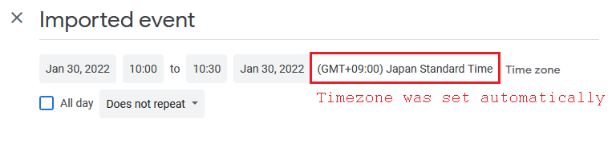

# Google Calendar Timezone Fix
This program fixes timezone of imported calendar events in Google Calendar.

## Backgrounds
When importing calendar events by ICS format into Google Calendar, the default timezone value `X-WR-TIMEZONE:` would be ignored and set as GMT+0.
Start and end time are kept as original, but when editing those entries will bring some confuse, since Google Calendar decides time based on GMT+0. Users want to reset those calendar entries as their original time zone.

## Prerequisites
You may need to create a new project in [Google Cloud Platform](https://console.developers.google.com/cloud-resource-manager) to get OAuth client credential.
1. Open [Google Cloud Platform](https://console.developers.google.com/cloud-resource-manager).
1. Login to your Google account (not required to login as the account you want to fix calendars), then create a new project.
1. Go to [APIs & Services >> Credentials](https://console.developers.google.com/apis/credentials), then issue a new OAuth 2.0 Client ID.
1. Open the issued entry, then remember **Client ID** and **Client secret** for the following steps.
1. Go to [APIs & Services >> OAuth consent screen](https://console.developers.google.com/apis/credentials/consent), then click **Add user**.
1. Fill your mail address that has Google Calendars to fix. That will allow this application to update your calendar.

## Build environments
Visual Studio 2019

## How to build
1. Open `CalendarFix.sln` with Visual Studio.
1. Copy and paste your OAuth client credential to  `OAUTH_CLIENT_ID` and `OAUTH_CLIENT_SECRET` variables inside `GoogleCalendarAPI.cs`.
1. Open **NuGet Package Manager** then issue following command to install the required library.  
`Install-Package Google.Apis.Calendar.v3`
1. (Optional) Edit following two lines in `Program.cs` to your preferable timezone value (IANA name; see [List of tz database time zones - Wikipedia](https://en.wikipedia.org/wiki/List_of_tz_database_time_zones)). The default is `Asia/Tokyo`.  
`item.Start.TimeZone = "Asia/Tokyo";`  
`item.End.TimeZone = "Asia/Tokyo";`
1. Click **Run** and enjoy.

## How to use
1. At first time, your browser will be opened then require login with your Google account. Your access token will be stored to `%APPDATA%\GoogleCalendarTimezoneFix` After logged in, the browser can be closed.
1. Select your calendar to fix. For example, type `7` and hit `Enter`.
1. Wait for a while until the program outputs the affect events.
1. Review them and type `yes` to continue.
1. Confirm updates at Google Calendar. Browser reload will be required.

## Screenshots

Then all calendar events would be updated like this.  
All values except timezone are maintained. Also entries which already have timezone are skipped.

## License
Apache Lisence 2.0
